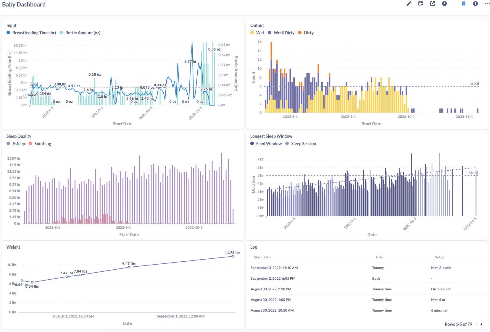

# Baby Dashboard

A project for visualizing baby-related data gathered from the [BabyFeedTimer](https://babyfeedtimer.app/) app and the [Snoo](https://www.happiestbaby.com/products/snoo-smart-bassinet) bassinet using Metabase and Postgres.



## Usage

```shell
# Start Metabase and Postgres
$ docker compose up -d

# Create an admin metabase user
$ bash scripts/create_metabase_users.sh

# Import data from baby feed timer and snoo
$ bash scripts/import.sh

# Watch a directory for CSV uploads from Baby Feed Timer and trigger imports
$ bash scripts/watch.sh
```